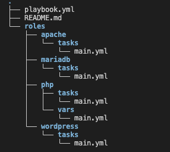
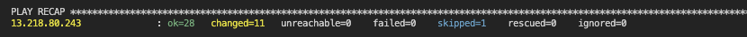
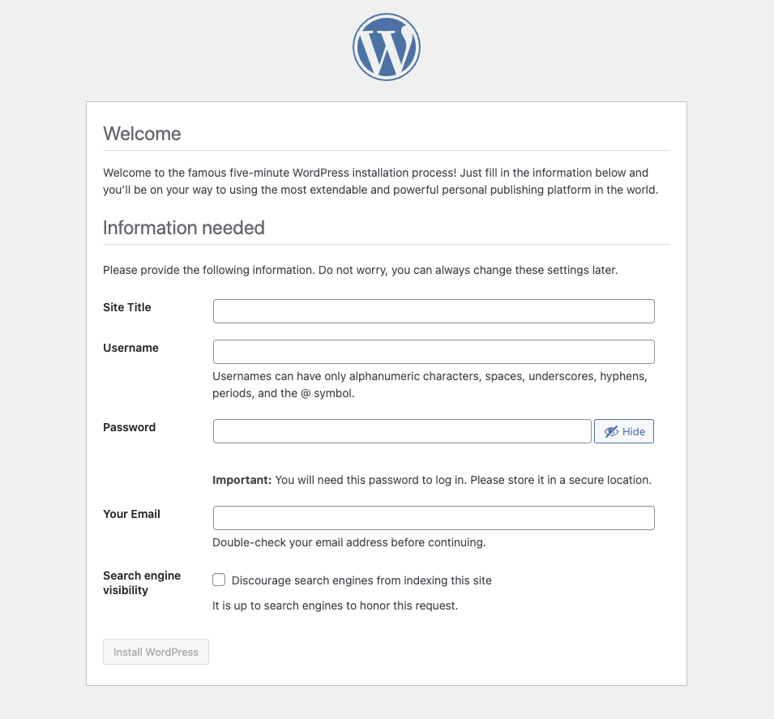
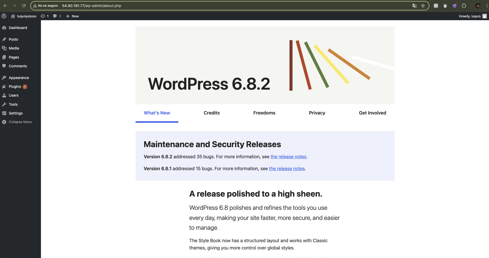
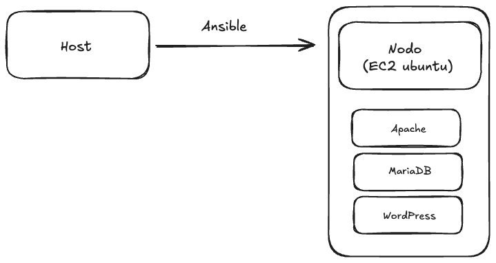

# Automated WordPress Installation with Ansible using Roles

This project automates the installation of WordPress on Ubuntu 22.04 using Ansible and a modular structure based on roles. Each role is responsible for a specific part of the installation and configuration process, making it easy to manage and extend.

## Architecture

- **Ansible Host:** Local machine created with Multipass (Ubuntu).
- **Managed Node:** EC2 instance in AWS with Ubuntu 22.04.
- **Connection:** SSH between the host and the remote node.

## Project structure

- `playbook.yml`: Main playbook that calls the roles.
- `roles/apache`: Installation and configuration of Apache.
- `roles/php`: Installation of PHP and required extensions.
- `roles/mariadb`: Installation, securing, and configuration of MariaDB.
- `roles/wordpress`: Installation and configuration of WordPress and Apache to serve the site.

## Automated steps

1. **Installation and configuration of Apache**
2. **Installation of PHP and extensions**
3. **Installation and securing of MariaDB**
4. **Creation of database and user for WordPress**
5. **Download and configuration of WordPress**
6. **Apache configuration for WordPress**

## Usage

1. Edit your inventory file to define the servers (local host and EC2 node).
   
   - The `inventory.ini` file must contain the public IP of your EC2 instance and SSH access data.
   
   - Ensure that the Ansible host (Multipass) has SSH access to the EC2 node and that port 22 is open in the AWS security group.

2. Run the main playbook:

   ```bash
   ansible-playbook -i inventory.ini site.yml
   ```

3. Once finished, open your browser and access the public IP of your EC2 instance to verify that WordPress is working:

   ```
   http://<EC2_PUBLIC_IP>
   ```

## Example of results and structure

### Project structure



### Successful playbook execution



### AWS


### WordPress installed and working




## Diagram

